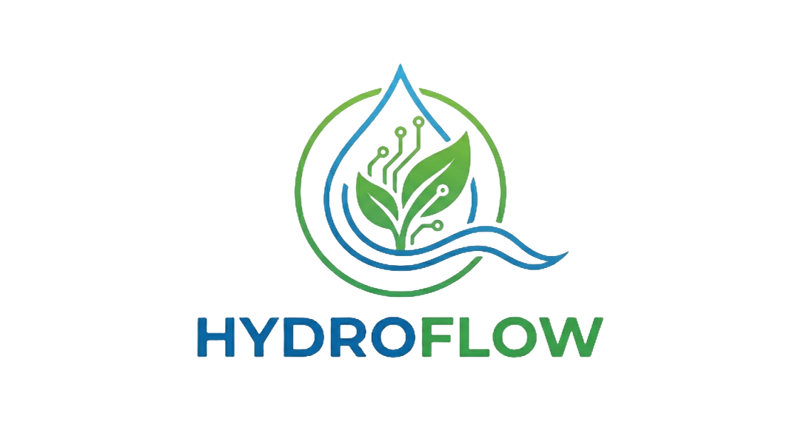
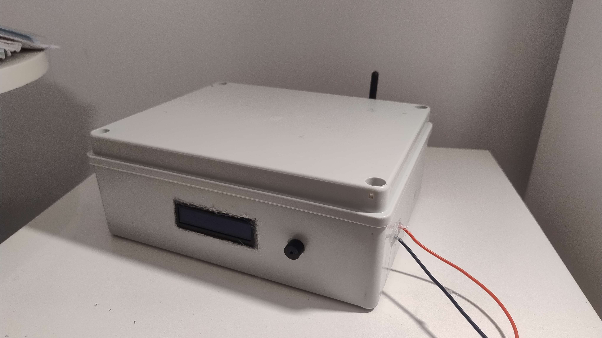
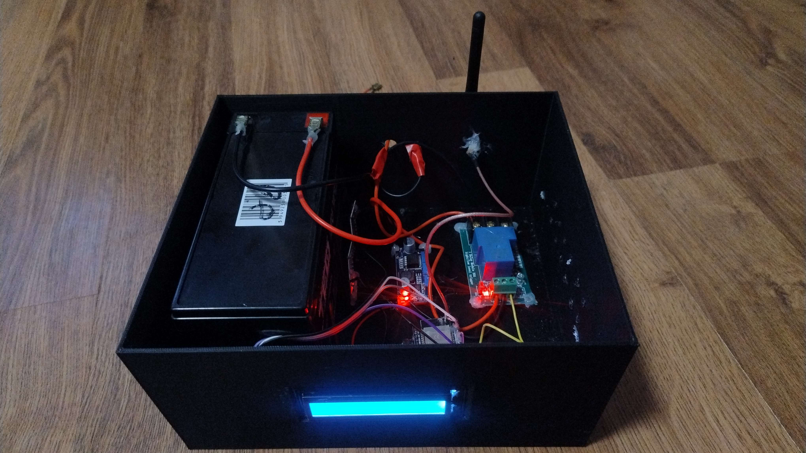
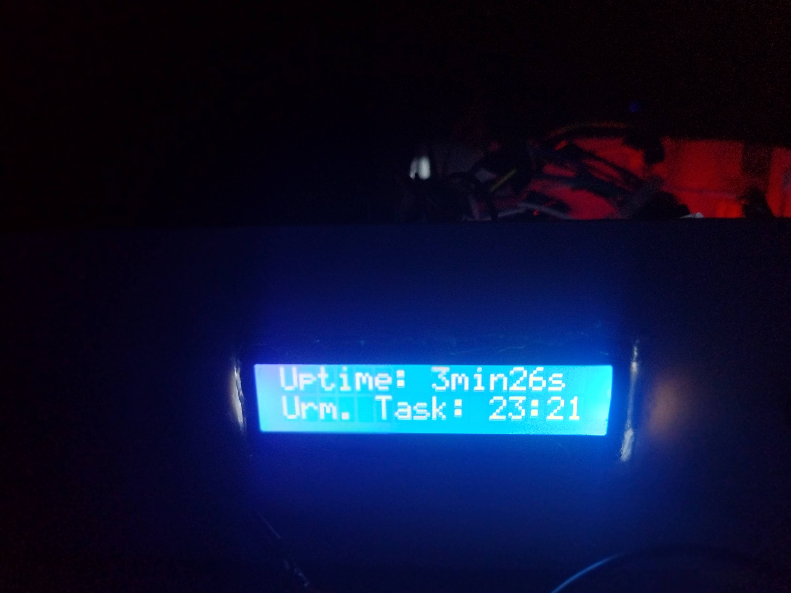

  
  <h1>HydroFlow is an amazing IoT-Based Smart Irrigation System that can distribute a large volume of water for your garden needs.
  

<h3><b>🌟 Features:</b></h3>
<ul>
<li>Automated Tasks for Irrigation</li>
<li>Saving all data on its Flash Memory (Json).</li>
<li><a href="https://github.com/alexxnder1/HydroFlow-Dashboard">Notifications, task manager & others in Android App</a></li>
<li>Linked with other devices through your own Home Router.</li>
<li>12V 7.1Ah High Range (1 week with screen off)</li>
<li>LCD Display</li>
</ul>

<h3><b>Hardware:</b></h3>
<ul>
<li>ESP32 DevKit V1 + External Antenna</li>
<li>24VDC Relay Module</li>
<li>12VDC Solenoid G3/4</li>
<li>LM2596 Buck-Boost Converter</li>
<li>12V 7.1Ah Pb Acid Battery</li>
<li>LCD 1602 + I2C Module</li>
</ul>

  
  
  

